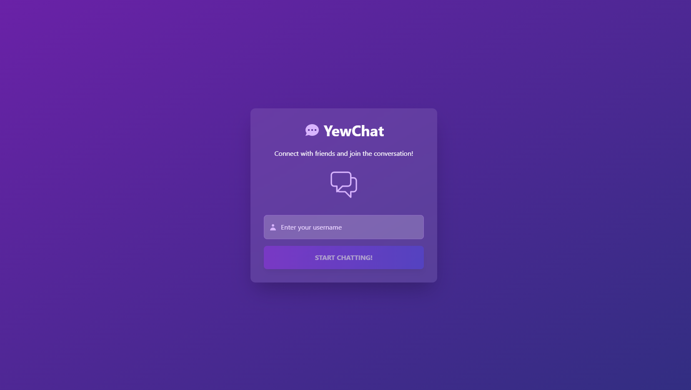
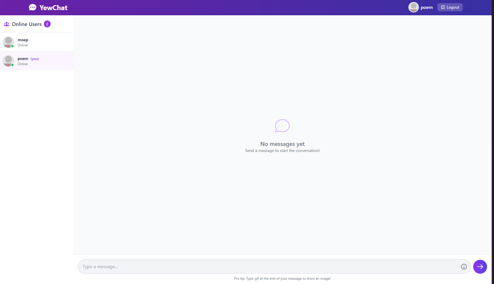
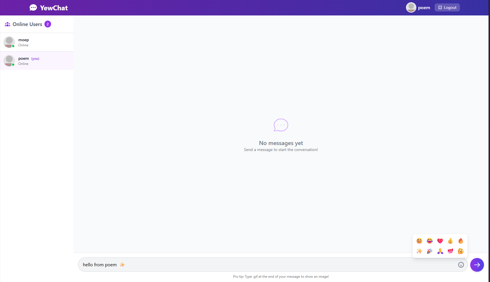
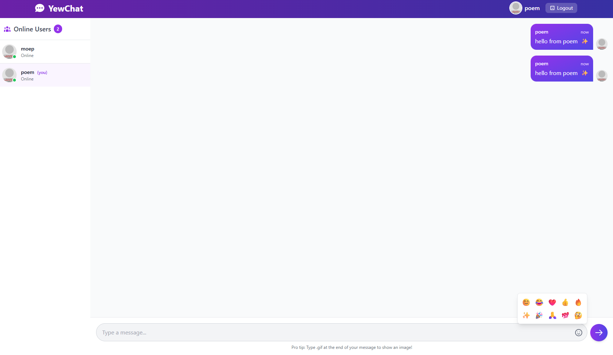

# async-tutorial-webchat-using-yew

Experiment 3.1: Original code

## Experiment 3.2: Be Creative!

For this experiment, I redesigned the YewChat application to make it more visually appealing and user-friendly. The enhancements include:

### 1. Modern UI Design
I transformed the basic chat interface into a modern, gradient-themed application with a cohesive purple and indigo color scheme that runs throughout the entire app. The design now includes:
- Sleek gradient backgrounds
- Translucent glass-like card effects
- Improved typography and spacing
- Enhanced visual hierarchy

### 2. Interactive Elements
Added several interactive elements to improve user engagement:
- Animated bouncing chat icon on the login page
- Emoji picker for adding reactions to messages
- Hover effects and smooth transitions for buttons and interactive elements
- Better visual feedback for user actions

### 3. Improved User Experience
- Redesigned message bubbles with distinct styling for sent vs. received messages
- Added user avatars generated based on usernames
- Improved the layout of the user list with online status indicators
- Added timestamps to messages
- Implemented empty state design for when no messages are present

### 4. Responsive Design
The interface now adapts better to different screen sizes, with the sidebar hiding on mobile devices to maximize the chat area.